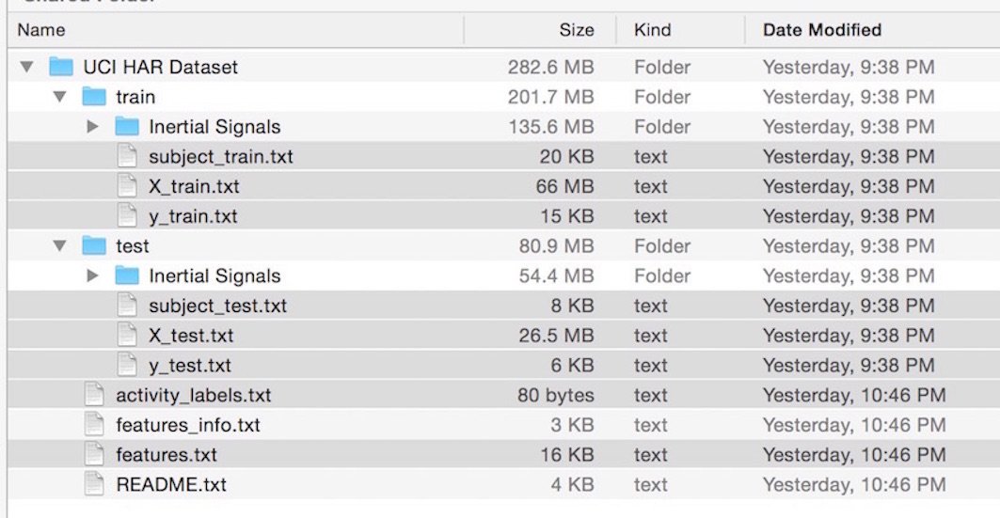
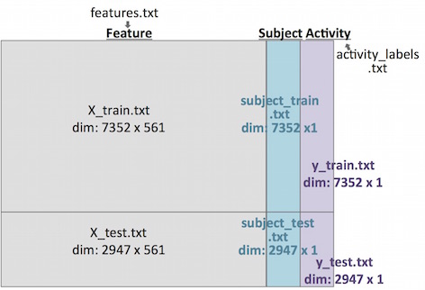

### The data source
[The raw data can be downloaded here.](https://d396qusza40orc.cloudfront.net/getdata%2Fprojectfiles%2FUCI%20HAR%20Dataset.zip)

 [A full description for the raw data can be found here.](http://archive.ics.uci.edu/ml/datasets/Human+Activity+Recognition+Using+Smartphones) 

### Download and unzip the dataset
*Save the dataset in the "Data" folder of your working directory*
```
fileUrl <- "https://d396qusza40orc.cloudfront.net/getdata%2Fprojectfiles%2FUCI%20HAR%20Dataset.zip"
download.file(fileUrl, destfile = "./Data/dataset.zip", method = "curl")
unzip(zipfile = "./Data/dataset.zip", exdir = "./Data")

```
*Structure of the "Data" folder. Grey-shaded files are used in "run_analysis.R"* 


*Relationship of 8 files                                    *                 


### Study design
(The following content was extracted from "README.txt" in the Data folder)  
The experiments have been carried out with a group of 30 volunteers within an age bracket of 19-48 years. Each person performed six activities (WALKING, WALKING_UPSTAIRS, WALKING_DOWNSTAIRS, SITTING, STANDING, LAYING) wearing a smartphone (Samsung Galaxy S II) on the waist. Using its embedded accelerometer and gyroscope, we captured 3-axial linear acceleration and 3-axial angular velocity at a constant rate of 50Hz. The experiments have been video-recorded to label the data manually. The obtained dataset has been randomly partitioned into two sets, where 70% of the volunteers was selected for generating the **training data** and 30% the **test data**.
   
#####For each record it is provided:   
- Triaxial acceleration from the accelerometer and the estimated body acceleration.  
- Triaxial Angular velocity from the gyroscope.  
- A **561-feature** vector with time and frequency domain variables.  
- An identifier of the subject who carried out the experiment.
- Its activity label. 

### The data
- X_train.txt: data of the training set.
- X_test.txt: data of the test set.
- subject_train.txt: identity of subject in training set. Range is 1:30.
- subject_test.txt: identity of subject in the test set. Range is 1:30.
- y_train.txt: activity labels in the training data set.
- y_test.txt: activity labels in the test data set.
- features.txt: List of all features (V1-V561).
- activity_labels.txt: Links the class labels with their activity name.

### Variables in "run_analysis.R" 
- mean(): Mean value of indicated time or frequency domain
- std(): Standard deviation of indicated time or frequency domain

### Notes for replacing with descriptive names
- prefix t is replaced by time
- prefix f is replaced by freq
- Acc is replaced by Accelerometer
- Gyro is replaced by Gyroscope
- Mag is replaced by Magnitude
- BodyBody is replaced by Body

 


